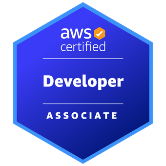

# Jordan Nguyen — SDET Portfolio Website

> A personal portfolio built and tested like a production application — featuring automated E2E testing, CI/CD pipelines, performance auditing, auto-healing selectors, contract testing, and shift-left quality gates.

[](https://github.com/JordanNguyen514/JordanNguyenWebsitePortfolio/actions/workflows/deploy.yml)
[](https://github.com/JordanNguyen514/JordanNguyenWebsitePortfolio/actions/workflows/post-deploy-tests.yml)
[](https://github.com/JordanNguyen514/JordanNguyenWebsitePortfolio/actions/workflows/lighthouse.yml)

**Live site:** [https://d2kmkdebgfkxyh.cloudfront.net](https://d2kmkdebgfkxyh.cloudfront.net)

---

## Table of Contents

- [About the Project](#about-the-project)
- [Tech Stack](#tech-stack)
- [Project Structure](#project-structure)
- [Getting Started](#getting-started)
- [Testing](#testing)
  - [E2E Tests (Cypress)](#e2e-tests-cypress)
  - [Unit Tests (Jest)](#unit-tests-jest)
  - [Contract Tests (Pact)](#contract-tests-pact)
  - [Performance Audits (Lighthouse CI)](#performance-audits-lighthouse-ci)
- [QA Engineering Features](#qa-engineering-features)
  - [Auto-Healing Selectors](#auto-healing-selectors)
  - [Shift Left — Pre-Commit Gates](#shift-left--pre-commit-gates)
  - [CI/CD Pipeline](#cicd-pipeline)
- [Infrastructure](#infrastructure)
- [Pages Overview](#pages-overview)
- [Certifications](#certifications)

---

## About the Project

This portfolio is both a personal website and a **living QA engineering showcase**. Every page is covered by automated tests that run in a real CI/CD pipeline against the production CloudFront distribution after every deployment.

The project intentionally applies enterprise QA patterns — auto-healing selectors, consumer-driven contract testing, shift-left pre-commit hooks, and Lighthouse performance gates — to demonstrate skills relevant to SDET and QA consultant roles.

---

## Tech Stack

| Layer | Technology |
|---|---|
| **Site Generator** | Jekyll 4.4 (Ruby) |
| **Hosting** | AWS S3 + CloudFront CDN |
| **CI/CD** | GitHub Actions |
| **E2E Testing** | Cypress 13 |
| **Unit Testing** | Jest 29 |
| **Contract Testing** | Pact Foundation v12 |
| **Performance** | Lighthouse CI (`@lhci/cli`) |
| **Linting** | ESLint 8 + `eslint-plugin-cypress` |
| **Pre-Commit Hooks** | Husky 9 |
| **Analytics** | AWS Kinesis + Lambda + QuickSight |
| **Contact Backend** | AWS API Gateway + Lambda |
| **Visitor Counter** | AWS API Gateway + Lambda + DynamoDB |

---

## Project Structure

```
JordanNguyenWebsitePortfolio/
│
├── .github/
│   └── workflows/
│       ├── deploy.yml              # Build Jekyll → push to S3 → invalidate CloudFront
│       ├── post-deploy-tests.yml   # Run Cypress E2E against live CloudFront URL
│       └── lighthouse.yml          # Lighthouse CI performance audit (post-deploy)
│
├── _layouts/
│   └── default.html                # Shared nav, footer, script imports
│
├── _includes/
│   └── certification_item.html     # Reusable certification badge component
│
├── assets/
│   ├── css/                        # Per-page stylesheets
│   │   ├── main.css                # Nav, footer, global resets
│   │   ├── FirstPage.css           # Homepage sections
│   │   ├── sdet.css                # SDET Showcase page
│   │   └── ...
│   ├── html/                       # Sub-pages (rendered by Jekyll)
│   │   ├── jobs.html
│   │   ├── internships.html
│   │   ├── certifications.html
│   │   ├── academic.html
│   │   ├── contacting.html
│   │   ├── emailing.html
│   │   ├── submissions.html
│   │   └── sdet.html               # SDET Showcase — skills matrix, pipeline diagram, QA metrics
│   └── js/
│       ├── main.js                 # Clock, visitor counter, scroll effects
│       ├── tracker.js              # AWS Kinesis event tracking
│       ├── analytics-dashboard.js  # Analytics section
│       └── contact_form_handler.js # Contact form → API Gateway → Lambda
│
├── cypress/
│   ├── e2e/
│   │   ├── smoke.cy.js                     # Full homepage smoke suite
│   │   ├── autoHeal_demo.cy.js             # Auto-healing selector showcase
│   │   ├── contact_form_spec.cy.js         # Contact form E2E (hits real Lambda)
│   │   ├── email_form_spec.cy.js           # Email form E2E
│   │   ├── jobs_page_spec.cy.js            # Jobs page toggle interactions
│   │   ├── internships_page_spec.cy.js     # Internships page
│   │   └── submissions_navigation_spec.cy.js
│   └── support/
│       ├── autoHeal.js             # Auto-healing selector engine
│       ├── commands.js             # Custom Cypress commands
│       └── e2e.js                  # Global hooks
│
├── pact/
│   ├── consumer.contact.test.js    # Consumer contract: frontend → Lambda
│   ├── provider.test.js            # Provider verification: Lambda honours contract
│   └── pacts/                      # Generated contract JSON files (gitignored in prod)
│
├── __tests__/
│   └── portfolio.unit.test.js      # Jest unit tests for JS utility functions
│
├── .husky/
│   └── pre-commit                  # Runs ESLint + Jest before every commit
│
├── .eslintrc.js                    # ESLint config (cypress plugin, no-var, eqeqeq, etc.)
├── lighthouserc.js                 # Lighthouse CI thresholds and URLs
├── cypress.config.js               # Cypress base URL and node event config
├── package.json                    # Scripts, deps (Cypress, Jest, LHCI, Pact, Husky)
├── _config.yml                     # Jekyll site config
├── Gemfile                         # Ruby gems (Jekyll, plugins)
└── index.html                      # Homepage (Jekyll front matter + Liquid templates)
```

---

## Getting Started

### Prerequisites

- **Node.js** 20+
- **Ruby** 3.3+ with Bundler
- **Git**

### Installation

```bash
# 1. Clone the repository
git clone https://github.com/JordanNguyen514/JordanNguyenWebsitePortfolio.git
cd JordanNguyenWebsitePortfolio

# 2. Install Node dependencies (Cypress, Jest, ESLint, Husky, etc.)
npm install

# 3. Install Husky pre-commit hooks
npx husky install

# 4. Install Ruby gems (Jekyll)
bundle install

# 5. Serve the site locally
bundle exec jekyll serve --port 8080
# → Site available at http://localhost:8080
```

---

## Testing

### E2E Tests (Cypress)

Cypress tests run against the **live production CloudFront URL** in CI, and against `localhost:8080` locally.

```bash
# Run all tests headlessly against production
npm test

# Run all tests headlessly against localhost
npm run test:local

# Open Cypress interactive runner (recommended for development)
npm run test:open
```

**Test suites:**

| File | What it covers |
|---|---|
| `smoke.cy.js` | Homepage load, nav dropdowns, social links, dynamic elements |
| `autoHeal_demo.cy.js` | Auto-healing selector strategies across 5 fallback levels |
| `contact_form_spec.cy.js` | Full form fill → Lambda API → success message assertion |
| `email_form_spec.cy.js` | Email form submission flow |
| `jobs_page_spec.cy.js` | Job card expand/collapse toggle state |
| `internships_page_spec.cy.js` | Internship card navigation and content |
| `submissions_navigation_spec.cy.js` | Submissions page routing |

### Unit Tests (Jest)

Fast, browser-free tests for JavaScript utility functions. Run in milliseconds — designed to run on every commit via the Husky pre-commit hook.

```bash
npm run test:unit              # Run once
npm run test:unit:watch        # Watch mode (re-runs on file save)
npm run test:unit:coverage     # With coverage report (threshold: 70%)
```

**Functions covered:** `checkTime()`, `formatVisitorCount()`, `isValidEmail()`, `sanitizeInput()`, `buildPageUrl()`

### Contract Tests (Pact)

Consumer-driven contract testing between the JS frontend and the AWS Lambda contact API. No live backend required for the consumer side.

```bash
# Step 1: Run consumer tests → generates pact/pacts/*.json contract file
npm run test:contract

# Step 2: Verify the real Lambda honours the contract
npm run test:contract:verify
```

**Contract location:** `pact/pacts/PortfolioFrontend-ContactLambda.json`

The contract defines the exact request/response shape the frontend expects. If the Lambda API changes (e.g., a field is renamed), `test:contract:verify` will catch it before it reaches production.

### Performance Audits (Lighthouse CI)

Lighthouse CI runs automatically after every successful deployment and on a weekly schedule. It audits 4 pages against defined score thresholds and uploads HTML reports as GitHub Actions artifacts.

```bash
# Run Lighthouse audits manually against production
npm run test:perf
```

**Quality thresholds:**

| Category | Threshold | Action on failure |
|---|---|---|
| Performance | ≥ 80 | Warn |
| Accessibility | ≥ 90 | **Fail build** |
| Best Practices | ≥ 90 | **Fail build** |
| SEO | ≥ 80 | Warn |
| Largest Contentful Paint | < 3000ms | Warn |
| Cumulative Layout Shift | < 0.15 | **Fail build** |

---

## QA Engineering Features

### Auto-Healing Selectors

Located in `cypress/support/autoHeal.js`. Replaces `cy.get()` with `cy.getHealed()` — a custom Cypress command that tries 5 selector strategies in priority order and uses Cypress's built-in retry engine to survive page transitions and lazy DOM rendering.

**Strategy priority (most stable → least stable):**

1. `[data-testid="token"]` — explicit test ID, survives all refactors
2. `[data-event-action="token"]` — existing analytics tracking attributes
3. `[aria-label="token"]` — accessibility attributes
4. `#token` — ID attribute
5. `.token` — CSS class (last resort)

```js
// Usage — drop-in replacement for cy.get()
cy.getHealed('Click_Jobs_Button').click();
cy.getHealed('hero-title').should('contain', 'Jordan Nguyen');
```

When an element is found via a fallback strategy (anything below strategy 2), the command logs a `⚠️ Heal Needed` warning recommending a `data-testid` be added — creating a self-documenting improvement backlog.

### Shift Left — Pre-Commit Gates

The Husky pre-commit hook (`.husky/pre-commit`) blocks commits automatically if either gate fails:

```
git commit -m "my change"

🔍 Running pre-commit quality gates...
📋 Gate 1/2 — ESLint (static analysis)      ✅ passed
🧪 Gate 2/2 — Jest Unit Tests               ✅ passed
✅ All pre-commit gates passed — committing!
```

**ESLint rules enforced:** `no-var`, `eqeqeq`, `no-debugger`, `prefer-const`, `cypress/no-unnecessary-waiting` (no `cy.wait(5000)`), `no-console` (warn).

To bypass in emergencies only:
```bash
git commit --no-verify -m "hotfix: urgent fix"
```

### CI/CD Pipeline

```
git push (master)
    │
    ▼
[deploy.yml — GitHub Actions]
    │  ├─ Checkout code
    │  ├─ Setup Ruby 3.3
    │  ├─ bundle exec jekyll build
    │  ├─ Configure AWS credentials
    │  ├─ aws s3 sync ./_site → S3 bucket
    │  └─ CloudFront invalidation (/* paths)
    │
    ▼ (on: workflow_run — deploy succeeded)
[post-deploy-tests.yml]
    │  ├─ npm install
    │  ├─ Cypress run (Chrome, CloudFront URL)
    │  ├─ Upload screenshots on failure
    │  └─ Upload videos always
    │
    ▼ (on: workflow_run — deploy succeeded)
[lighthouse.yml]
    │  ├─ Wait 45s for CloudFront propagation
    │  ├─ lhci autorun (3 runs × 4 pages)
    │  ├─ Assert score thresholds
    │  └─ Upload HTML reports (30-day retention)
```

---

## Infrastructure

All backend services run on AWS in the `ca-central-1` region.

| Service | Purpose |
|---|---|
| **S3** | Static site hosting (Jekyll `_site/` output) |
| **CloudFront** | CDN with global edge caching, HTTPS |
| **API Gateway + Lambda** | Contact form submission handler |
| **API Gateway + Lambda + DynamoDB** | Visitor counter (persistent hit tracking) |
| **Kinesis + Lambda** | Real-time user interaction event streaming |
| **QuickSight** | Analytics dashboard (linked from homepage) |

AWS credentials are stored as GitHub Actions secrets (`AWS_ACCESS_KEY_ID`, `AWS_SECRET_ACCESS_KEY`, `AWS_S3_BUCKET`, `DISTRIBUTION_ID`).

---

## Pages Overview

| Page | URL | Description |
|---|---|---|
| Home | `/` | Hero, Career Portfolio links, Skills bars, Analytics, Social |
| Jobs | `/assets/html/jobs.html` | Timeline of work experiences with expandable detail cards |
| Internships | `/assets/html/internships.html` | Internship history |
| Certifications | `/assets/html/certifications.html` | AWS & ISTQB badge showcase |
| Academics | `/assets/html/academic.html` | Academic background |
| **SDET Showcase** | `/assets/html/sdet.html` | Skills matrix, automation code showcase, CI/CD diagram, QA metrics dashboard |
| Contact Form | `/assets/html/contacting.html` | Form → API Gateway → Lambda → email |
| Email Form | `/assets/html/emailing.html` | Direct email form |
| Submissions | `/assets/html/submissions.html` | View past form submissions |

---

## Certifications

| Badge | Certification | Issued | Expires |
|---|---|---|---|
|  | AWS Certified Developer – Associate | Feb 2026 | Feb 2029 |
|  | AWS Certified Cloud Practitioner | Aug 2023 | Feb 2029 |
|  | ISTQB Certified Tester (Foundation) | Mar 2021 | Never (lifetime) |

---

*Built with Jekyll · Hosted on AWS · Tested with Cypress · © Jordan Nguyen*
